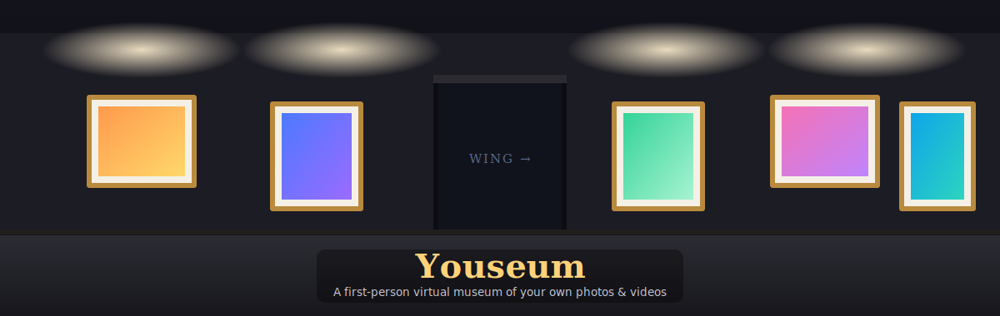

# Youseum

A self‑contained, **first‑person virtual museum** you fill with your own photos and videos. Start in a single room, walk around in first person, hang your media on the walls, and grow the place into picture‑lined **halls** and gallery **wings** — all in the browser, with nothing uploaded anywhere.



### ▶ [Live demo → grenparptar.github.io/Youseum](https://grenparptar.github.io/Youseum/)

> Low‑powered device? Use the lightweight mode: [`/Youseum/?lite`](https://grenparptar.github.io/Youseum/?lite)

---

## Features

- **First‑person tour** — WASD + mouse look (pointer lock) on desktop, on‑screen joystick + drag‑to‑look on touch devices.
- **Your own media** — drag & drop, or look at a frame and click to hang a photo or video. Videos loop and can be played/paused with sound.
- **Build it as you go** — face any wall and **left‑click for a hall** (a picture‑lined corridor) or **right‑click for a wing** (a full gallery room). Doorways are flanked by pictures on both sides.
- **Themes & names** — 6 themes (Classic Hall, Modern White, The Garden, Midnight, Rose Gallery, Slate Loft); name each room.
- **Background music** — built‑in generative ambient pad, or load your own track — globally or per room (crossfades as you walk between rooms).
- **Find your way** — live minimap, a room **overview** with thumbnails, and a cinematic **guided auto‑tour**.
- **Save & share** — everything persists in your browser; **export/import** a single `.museum` file (media + music included), or copy a **share link** that carries the layout (no server needed).

## Controls

| Desktop | |
|---|---|
| `W` `A` `S` `D` | Move |
| Mouse | Look |
| `Shift` | Run |
| Left‑click | Fill a frame / build a hall |
| Right‑click | Build a wing |
| `E` | Play / pause video |
| `M` | Mute · `T` Title a frame · `⌫` Clear a frame |
| `T` (facing a wall) | Add / edit that wall's large heading · `⌫` to remove it |
| `Esc` | Pause & free the cursor (use the map/menu to jump around) |

**Touch:** left thumb to move, drag the right side to look, **USE** to fill a frame or build a hall, **+WING** to build a room. The **☰** menu holds everything else.

## How your media is stored

Everything stays **local to your browser** in IndexedDB — photos/videos are kept as the original files (blobs), keyed to each frame. Nothing is uploaded to a server.

- To move a museum to another device or back it up, use **Export** (the `.museum` file bundles all media + music) and **Import**.
- **Share links** carry only the layout (room names, themes, frame titles) — they're small enough to fit in a URL. They do **not** include the actual photos/videos (too large for a link); share the exported file for those.

## Run it locally

It's a single `index.html`, but it uses ES modules + a CDN, so serve it over HTTP rather than opening the file directly:

```bash
# from the repo root
python -m http.server 5577
# then open http://localhost:5577
```

An internet connection is needed the first time, to load [three.js](https://threejs.org/) from a CDN.

## Tech

- [three.js](https://threejs.org/) (WebGL) with ACES tone mapping and bloom
- Vanilla JS / HTML / CSS — no build step
- IndexedDB for persistence; Web Audio for the generative soundtrack
- Deployed to GitHub Pages via GitHub Actions (`.github/workflows/deploy-pages.yml`)

## License

MIT — see [LICENSE](LICENSE).
